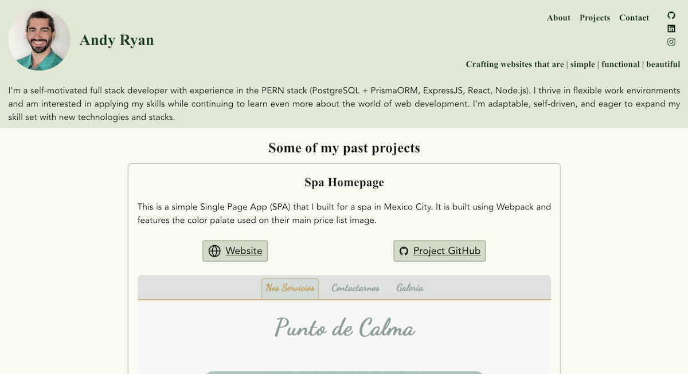

# My Personal Website V2

## Table of Contents

- [Description](#description)
- [Installation Instructions](#installation-instructions)
- [Usage and Screenshots](#usage-and-screenshots)
- [Technologies Used](#technologies-used)
- [Dependencies and Credits](#dependencies-and-credits)
- [Project Structure](#project-structure)

## Description

This is my personal website that I crafted for displaying my portfolio. All my web development learning up to this point has been via [The Odin Project](https://www.theodinproject.com) and I am very grateful. This site will showcase my projects to show potential clients and employers what my capabilities are. 

## Installation Instructions

1. Clone or fork this repo
2. cd into the project root directory [^1]
3. Run the following in your terminal [^2]
    - ``` bash
      npm init -y
      npm install react react-dom react-router-dom
      npm install lucide-react uuid
      npm install @eslint/js @types/react --save-dev
      npm install @types/react-dom @vitejs/plugin-react
      npm install eslint eslint-config-prettier --save-dev
      npm install eslint-plugin-react-hooks eslint-plugin-react-refresh --save-dev
      npm install globals vite --save-dev
      ```
1. `npm run dev`
   - `^` + `c` will end the process 
1. Navigate to the url displayed in the terminal: `➜  Local:   http://localhost:5173/`

## Usage and Screenshots

<!-- 
 

Here's a brief description of how to use the app. 

- [Link to live preview](https://groundedwanderer.dev/) 
-->

### Features
- Display my portfolio
- Sticks to my core design principles of: Simple, Functional, Beautiful

## Technologies Used

### Frontend

- <a href="https://vite.dev/"> Vite </a>
- <a href="https://react.dev/"> React</a>
- <a href="https://developer.mozilla.org/en-US/docs/Web/JavaScript"> JavaScript</a>
- <a href="https://developer.mozilla.org/en-US/docs/Web/HTML"> HTML</a>
- <a href="https://developer.mozilla.org/en-US/docs/Web/CSS"> CSS</a>

### Development Tools

- <a href="https://code.visualstudio.com/"> VS Code</a>
- <a href="https://www.npmjs.com/"> NPM</a>
- <a href="https://git-scm.com/"> Git</a>

### Hosting

- <a href="https://www.cloudflare.com/"> Cloudflare</a>
- <a href="https://github.com/"> Github</a>

## Dependencies and Credits

### Package Dependencies

- [lucide-react](https://www.npmjs.com/package/lucide-react)
- [react](https://www.npmjs.com/package/react)
- [react-dom](https://www.npmjs.com/package/react-dom)
- [react-router-dom](https://www.npmjs.com/package/react-router-dom)
- [@eslint/js](https://www.npmjs.com/package/@eslint/js)
- [@types/react](https://www.npmjs.com/package/@types/@types/react)
- [@types/react-dom](https://www.npmjs.com/package/@types/react-dom)
- [@vitejs/plugin-react](https://www.npmjs.com/package/@vitejs/plugin-react)
- [eslint](https://www.npmjs.com/package/eslint)
- [eslint-config-prettier](https://www.npmjs.com/package/eslint-config-prettier)
- [eslint-plugin-react-hooks](https://www.npmjs.com/package/eslint-plugin-react-hooks)
- [eslint-plugin-react-refresh](https://www.npmjs.com/package/eslint-plugin-react-refresh)
- [globals](https://www.npmjs.com/package/globals)
- [vite](https://www.npmjs.com/package/vite)
- [uuid](https://www.npmjs.com/package/uuid)

### Other Credits

- [Devicion](https://devicon.dev/)
- [Skillicons](https://skillicons.dev/)
- [Ionicons](https://ionic.io/ionicons)


## Project Structure

```bash
├──public/                 # Locally hosted images and icons
├──src/                    # Source files
    ├──pages/              # Full page React components
    ├──partials/           # Smaller React components
└──test/                   # Test files
```

[^1]: Where the README.md file is located
[^2]: You are free to install all the dev dependencies on a single line instead of breaking them up like this. I've found that breaking them up is more reliable with slower internet connections.